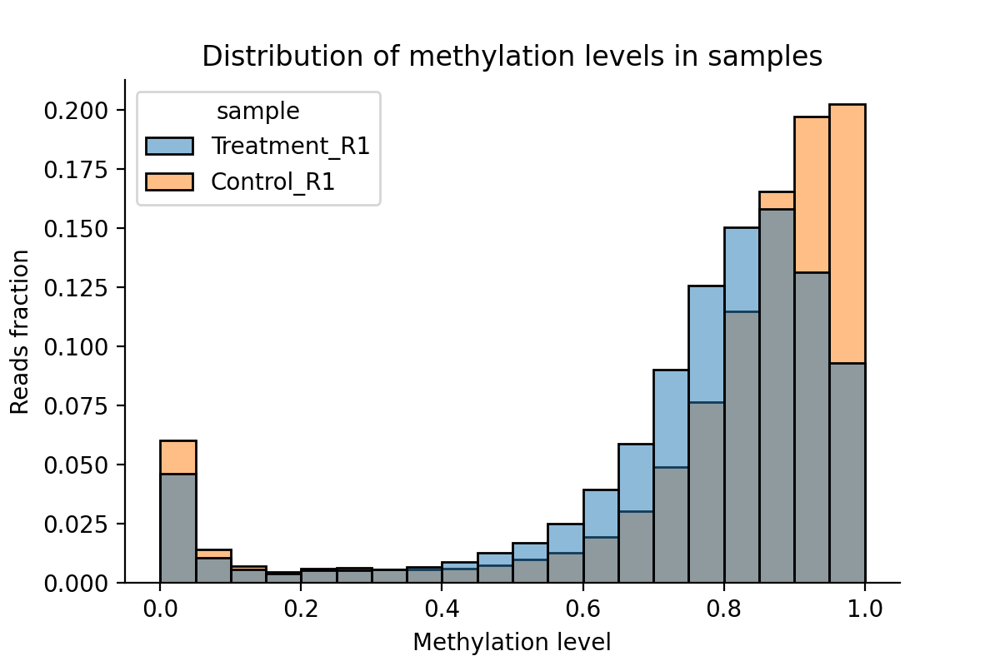
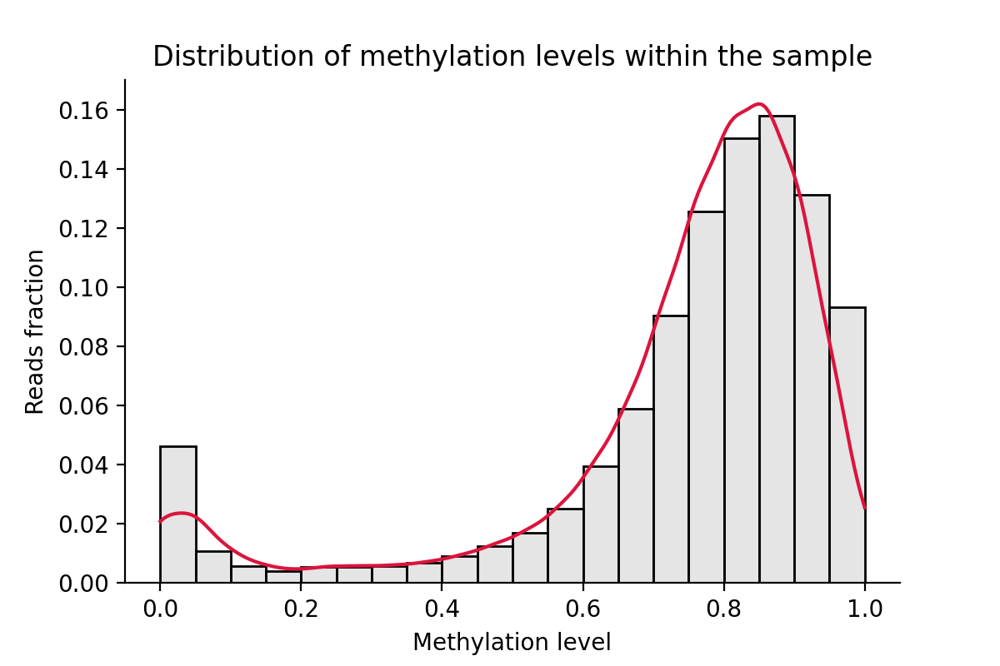
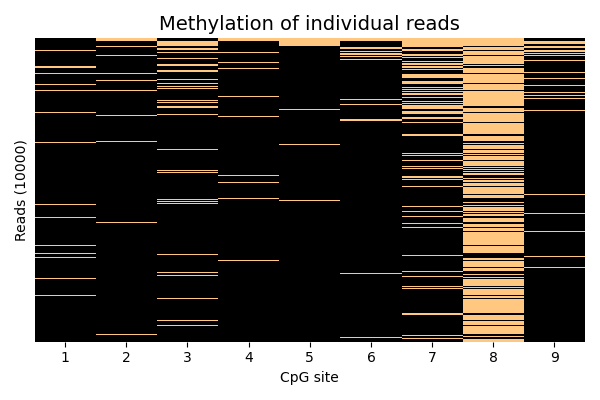

# allelicMeth
`allelicMeth` is a script for analysis and visualization of methylation levels of individual DNA molecules. As input, it takes `fasta` file containing a reference sequence and `sam` file(s) with bisulfite sequencing reads aligned to this reference sequence. In the current implementation, `allelicMeth` can only process bisulfite amplicon sequencing (BSAS) with a single-end sequencing, or pair-end sequencing if two reads are merged in one DNA molecule corresponding to an amplicon.

## Typical usage      
`allelicMeth [options]`  

Can be executed without arguments from a working directory containing `fasta` and `sam` file(s).

## Options  
* `--fasta <str: fasta_file>`  
Fasta file used for generation of SAM files. Will be used to extract postitions of CpG sites. If not provided, `allelicMeth` will read the `CWD` to find `.fa` or `.fasta` file.  

* `--sam <str: sam_file(s)>`  
Sam file(s) containing bisulfite sequencing reads. If non is provided `allelicMeth` will read `CWD` and analyse all `.sam` files in `CWD`. 

* `--mode <str: single | multiple>`  
There are two modes `single` (default) and `multiple`. In a `single` mode one histogram will be produced for every `.sam` file. In `multiple` mode several data sets will be plotted on one histogram (generated from all `.sam` files passed to the script).  

* `--reads2plot <INT>`  
Number of reads to be plotted on heatmaps. If the passed number is greater than the total read number in an input file(s), then the last one will be used.  

## Examplary output  
   